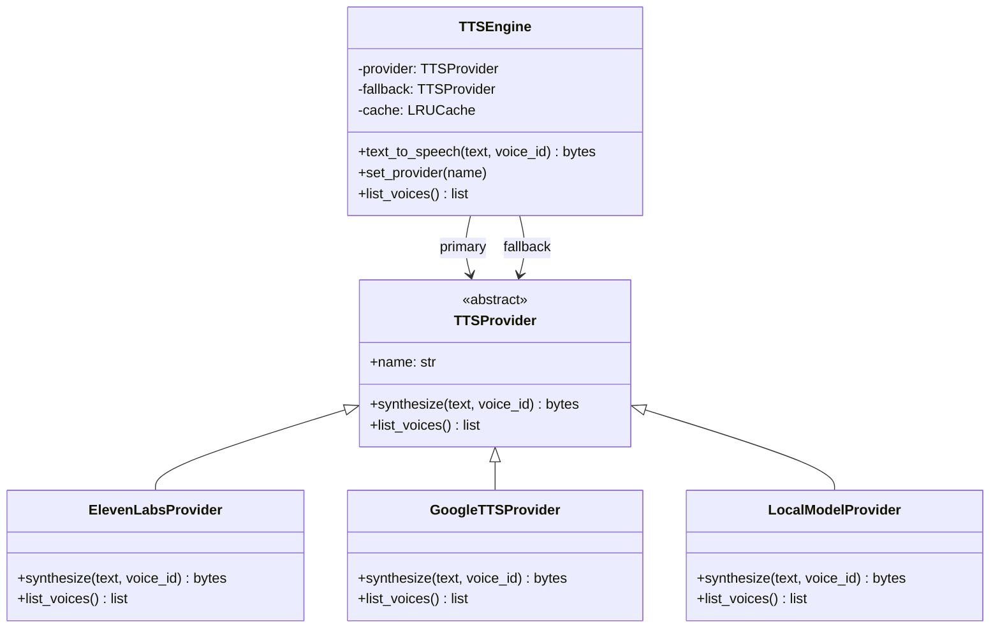

# Upgrade TTS: Pluggable Provider Architecture

Replace Google TTS with a **pluggable TTS provider system** that supports ElevenLabs now and can easily swap to any engine (local model, Azure, etc.) later.

## Architecture



## File Structure

```
backend/
├── tts/
│   ├── __init__.py          # Exports TTSEngine + text_to_speech()
│   ├── engine.py            # TTSEngine: cache + fallback + provider routing
│   ├── base.py              # TTSProvider abstract base class
│   ├── providers/
│   │   ├── __init__.py
│   │   ├── elevenlabs.py    # ElevenLabs API implementation
│   │   ├── google_tts.py    # Existing gTTS (now as a provider)
│   │   └── local_model.py   # Stub for future local TTS model
│   └── config.py            # All TTS settings loaded from .env
├── text_processor.py        # Merge short subtitle chunks → sentences
├── .env.example             # API key template
└── ...
```

## Proposed Changes

### Backend

---

#### [NEW] `tts/base.py` — Abstract provider interface

```python
class TTSProvider(ABC):
    name: str
    def synthesize(self, text: str, voice_id: str = None) -> bytes: ...
    def list_voices(self) -> list[dict]: ...
```

Any new TTS engine just implements this interface.

---

#### [NEW] `tts/providers/elevenlabs.py` — ElevenLabs implementation

- Uses `elevenlabs` Python SDK
- Configurable `voice_id`, `model_id`, `stability`, `similarity_boost`, `speed`

#### [NEW] `tts/providers/google_tts.py` — Existing gTTS wrapped as provider

- Moves current [tts.py](file:///c:/Learning/VideoDub/backend/tts.py) logic here (unchanged)
- Acts as default when no API key is set

#### [NEW] `tts/providers/local_model.py` — Stub for local models

- Placeholder structure for future local TTS (e.g. VITS, Coqui, Bark)
- Raises `NotImplementedError` with instructions

---

#### [NEW] `tts/engine.py` — Core engine with cache + fallback

- Provider-agnostic LRU cache: `cache[hash(text + voice_id)] → mp3_bytes`
- Fallback chain: primary provider fails → fallback provider
- `set_provider("elevenlabs" | "google" | "local")` to switch at runtime

#### [NEW] `tts/config.py` — Centralized configuration

- Loads from `.env` via `python-dotenv`
- `TTS_PROVIDER` = `"elevenlabs"` | `"google"` | `"local"`
- ElevenLabs: `ELEVENLABS_API_KEY`, `ELEVENLABS_VOICE_ID`, `ELEVENLABS_MODEL`
- Voice presets, speed/pitch control

---

#### [NEW] `text_processor.py` — Sentence merging

- Merges consecutive short segments into natural sentences
- Adds missing punctuation (`.` if not ending with `.!?`)
- Preserves timing: merged segment uses first [start](file:///c:/Learning/VideoDub/chrome-extension/content.js#199-216), summed `duration`

---

#### [MODIFY] [main.py](file:///c:/Learning/VideoDub/backend/main.py)

- Import [text_to_speech](file:///c:/Learning/VideoDub/backend/tts.py#11-38) from `tts` package (same function name, drop-in)
- Add sentence merging step before TTS
- Add `GET /api/voices` endpoint
- Accept optional `voiceId` in request body

#### [MODIFY] [requirements.txt](file:///c:/Learning/VideoDub/backend/requirements.txt)

- Add `elevenlabs`, `python-dotenv`

#### [DELETE] [tts.py](file:///c:/Learning/VideoDub/backend/tts.py) — replaced by `tts/` package

---

### Chrome Extension

#### [MODIFY] [content.js](file:///c:/Learning/VideoDub/chrome-extension/content.js)

- Preload next 2 audio segments via `audio.load()` for gapless playback

---

## How to Add a New TTS Provider Later

1. Create `tts/providers/my_engine.py`
2. Subclass `TTSProvider`, implement `synthesize()` and `list_voices()`
3. Register in `tts/config.py` → set `TTS_PROVIDER=my_engine` in `.env`
4. Done — caching and fallback work automatically

## Verification Plan

1. Default (no API key) → should use Google TTS
2. Set `ELEVENLABS_API_KEY` → should use ElevenLabs
3. Test cache: duplicate text → second call instant
4. Test fallback: invalid API key → falls back to Google TTS
5. Test `GET /api/voices`
6. Test sentence merging with short subtitle segments
